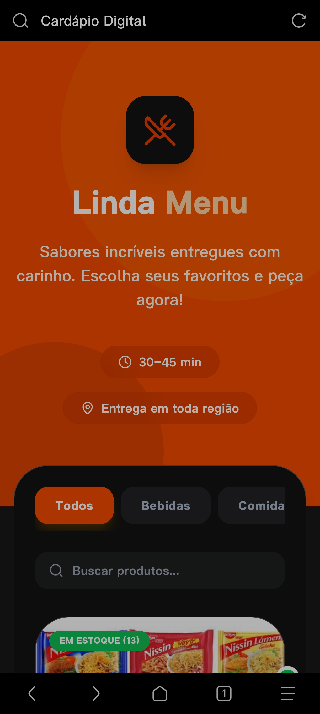
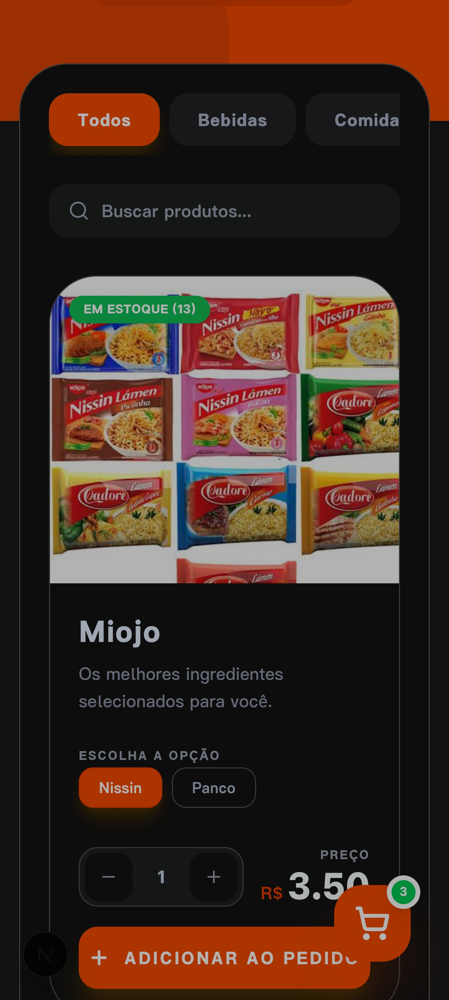
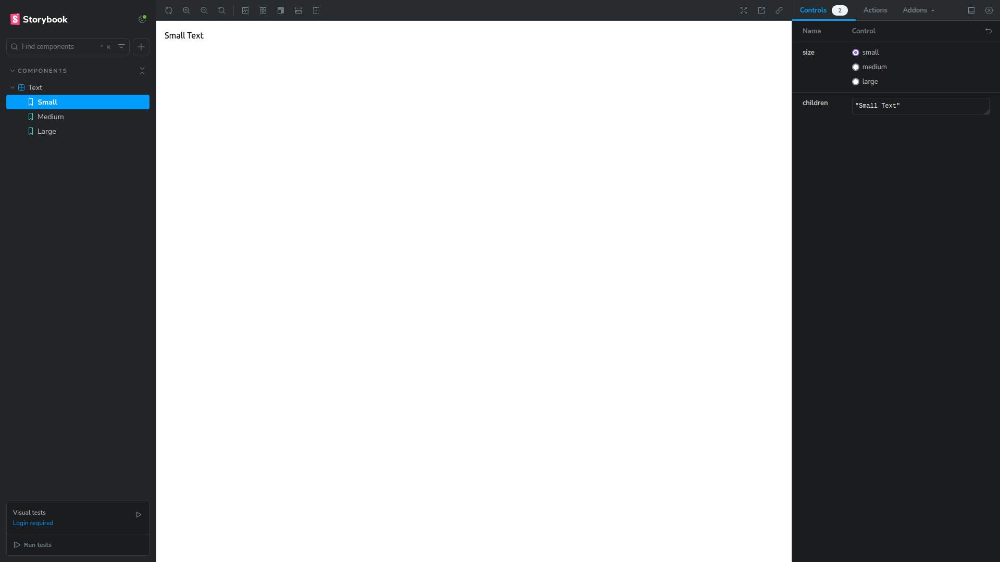

# Linda Menu - Digital Menu Application

Linda Menu is a modern, high-performance digital menu application built with Next.js 15+, designed to provide a seamless ordering experience. It features a responsive interface, category filtering, and a shopping cart system.

## 📱 Screenshots

<div align="center">
  
  
</div>

<div align="center">
  
</div>

## 🚀 Technologies

This project leverages a modern tech stack:

- **Framework:** [Next.js](https://nextjs.org/) (App Router)
- **Language:** [TypeScript](https://www.typescriptlang.org/)
- **Styling:** [Tailwind CSS](https://tailwindcss.com/)
- **Backend & Database:** [Supabase](https://supabase.com/)
- **State Management:** [Zustand](https://github.com/pmndrs/zustand)
- **Animation:** [Framer Motion](https://www.framer.com/motion/)

## ⚙️ Getting Started

### Prerequisites

- Node.js (Latest LTS recommended)
- Supabase Account

### Installation

1. **Clone the repository:**

   ```bash
   git clone <repository-url>
   cd Linda-Menu
   ```

2. **Install dependencies:**

   ```bash
   npm install
   # or
   yarn install
   # or
   bun install
   ```

3. **Environment Setup:**
   Copy the example environment file and fill in your credentials:
   ```bash
   cp enviroment-example.env .env.local
   ```
   Edit `.env.local` with your `NEXT_PUBLIC_SUPABASE_URL`, `NEXT_PUBLIC_SUPABASE_ANON_KEY`, and `NEXT_PUBLIC_WHATSAPP_NUMBER`.

### Running the Project

To start the development server:

```bash
npm run dev
```

Open [http://localhost:3000](http://localhost:3000) with your browser to see the result.

## 🛠️ Maintenance

- **Testing:** Run the test suite.
  ```bash
  npm test
  ```
- **Linting:** Check for code quality issues.
  ```bash
  npm run lint
  ```
- **Build:** Create a production-ready build.
  ```bash
  npm run build
  ```

## 📝 License

This project is licensed under the MIT License - see the [LICENSE](LICENSE) file for details.

---

Developed with ❤️ for a better dining experience.
details.

---

Developed with ❤️ for a better dining experience.
